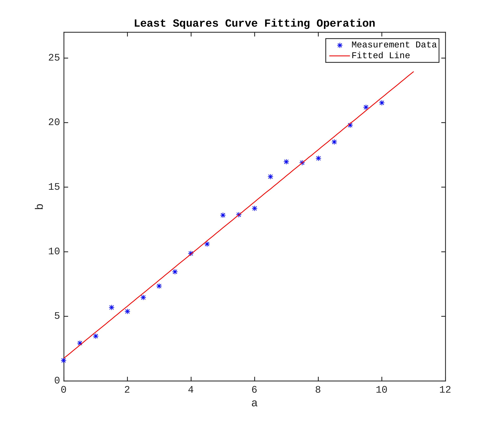
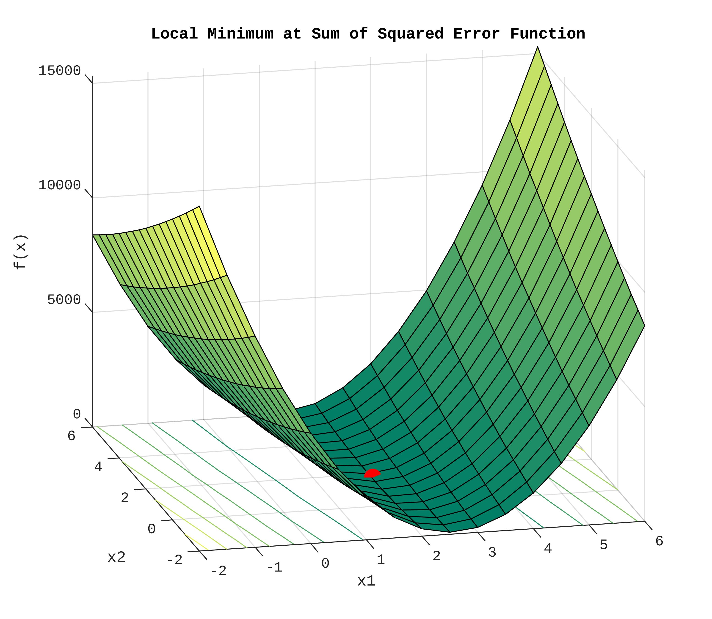

# Simple Least Square Curve Fitting Problem

This repo is used to create figures which show the intution behind the Levenberg–Marquardt algorithm. The LM algorithm is used to solve non-linear optimization problems.

**lsqcurvefit** is used from Matlab's optimization toolbox. 

## Curve Fitting Example

## Finding a Local Minimum

